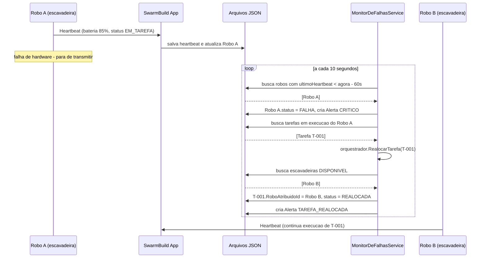
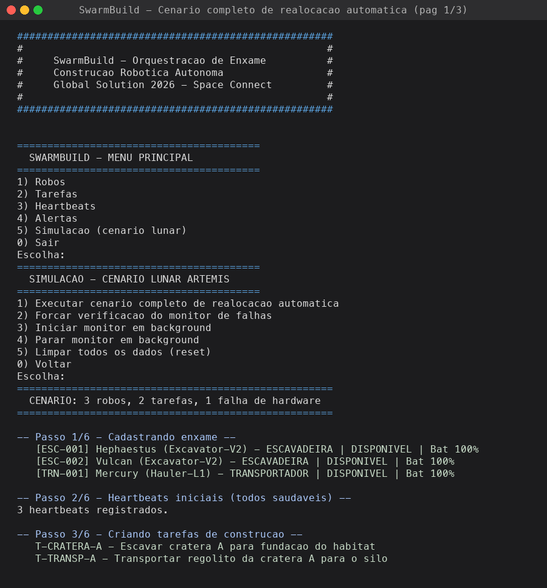
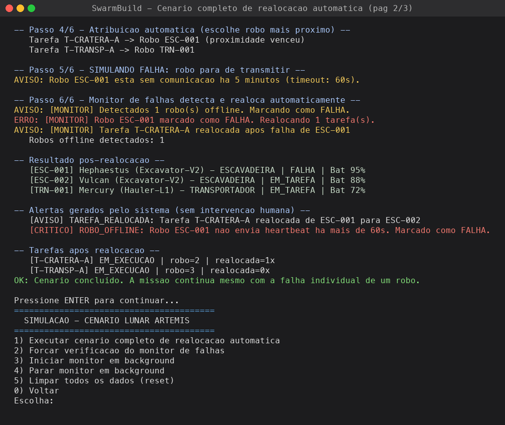
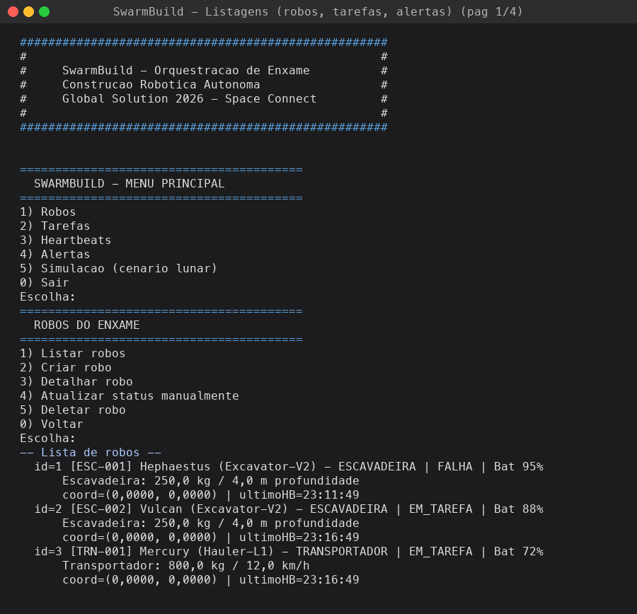
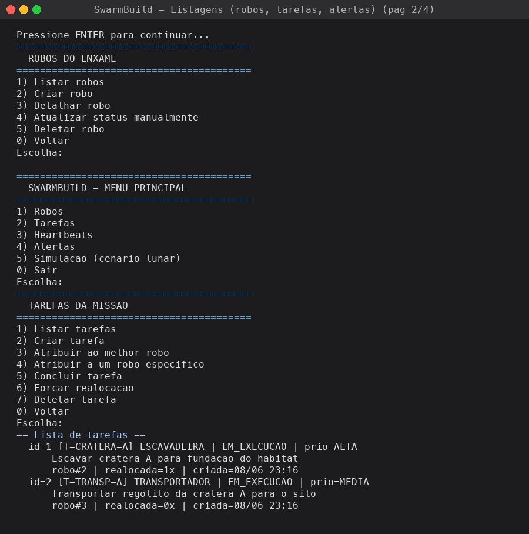
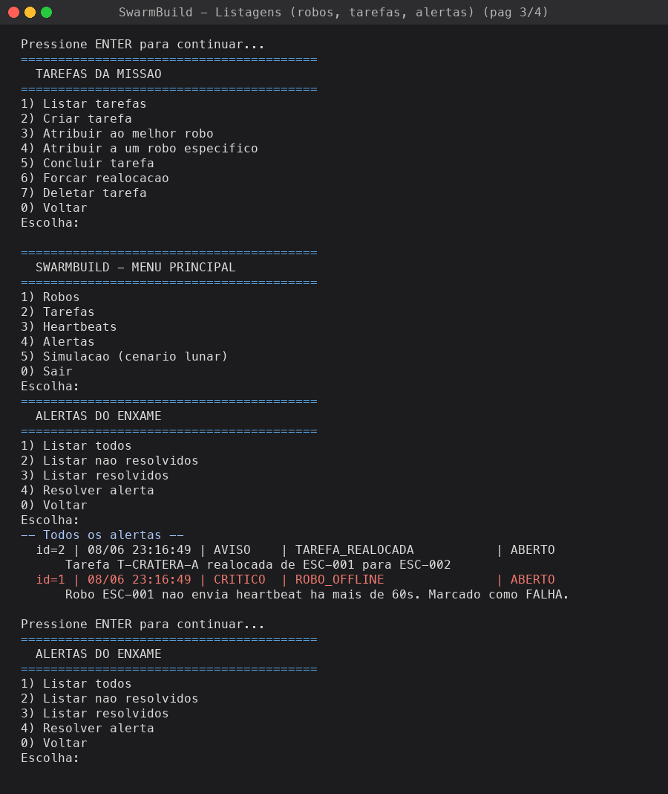
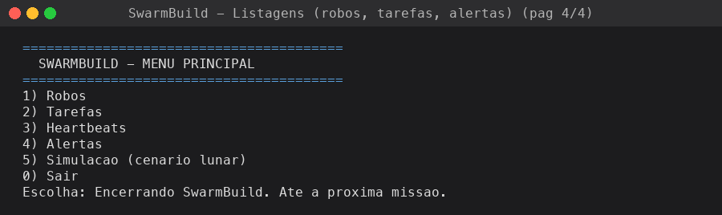
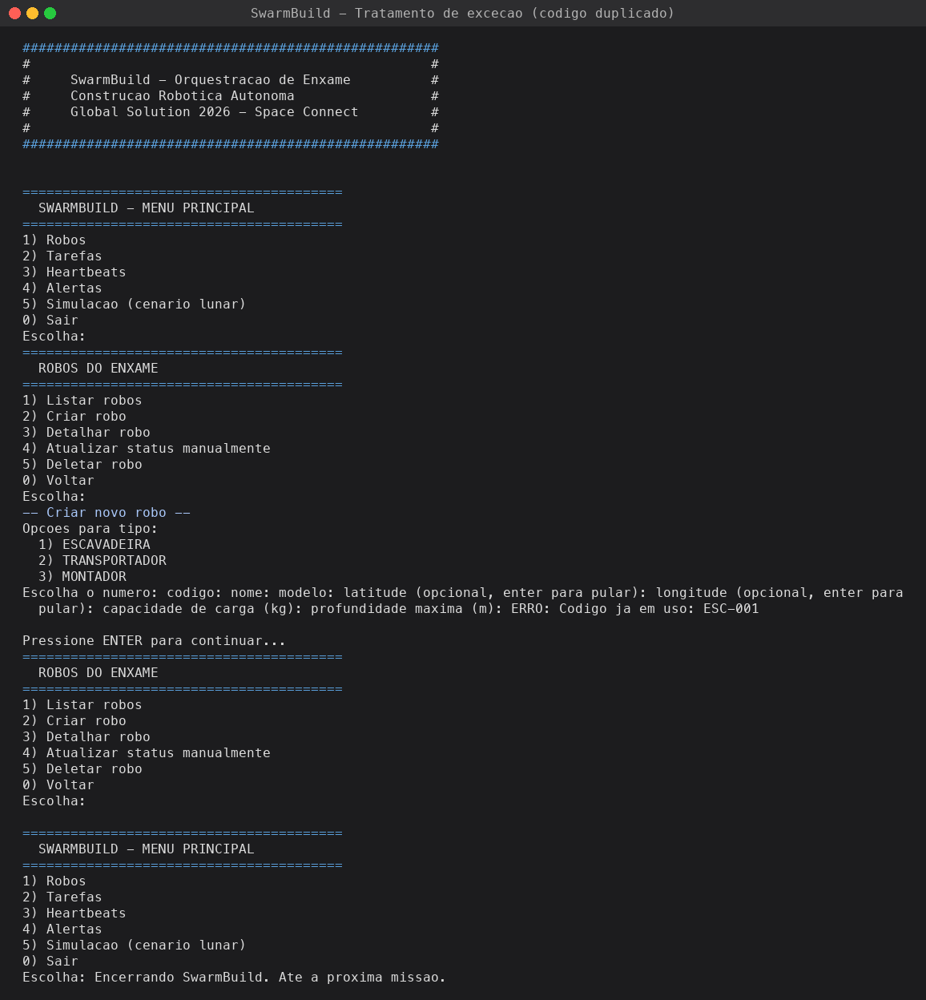

# SwarmBuild .NET — Global Solution 2026 (Space Connect)

**Aplicacao .NET de console que orquestra um enxame robotico autonomo para construcao de infraestrutura em ambientes hostis (base lunar).**

Porte para C# / .NET 10 do nosso projeto Spring Boot (`GS_2026_FIAP_SOA`), agora atendendo aos requisitos da entrega de **C# (FIAP - 09/06)**.

---

## Integrantes do grupo

| RM | Nome |
|--------|------|
| 554981 | Bruno Gabriel Silva Dominicheli |
| 555528 | Gabriel Gouvea Marques de Oliveira |
| 556198 | Miguel Kapicius Caires |
| 555608 | Thiago Ferreira Oliveira |

---

## Motivacao do projeto

A Global Solution **Space Connect** desafia os alunos a:

> _"propor solucoes que usem tecnologia, dados e inovacao para resolver desafios na Terra,
> expandir as possibilidades da economia espacial e criar oportunidades para o futuro."_

O programa **Artemis** pretende construir uma base lunar **antes** da chegada dos astronautas. Quem constroi sao **robos**. Mas o ambiente lunar e implacavel: poeira altamente abrasiva, terreno irregular e radiacao. Pior — a Terra esta a mais de **380 mil km**, com **delay de comunicacao de ate 3 segundos**. Nao da para esperar um operador em Houston decidir o que fazer toda vez que um robo trava.

**SwarmBuild** e a camada de software que orquestra o enxame de forma autonoma:

1. Cada robo envia um **heartbeat** periodico (bateria, posicao, status).
2. Se um robo **para de responder**, o sistema **detecta a falha automaticamente**.
3. A tarefa do robo falho e **realocada para outro robo compativel**, **sem intervencao humana**.
4. Todo evento critico vira um **alerta** persistido em disco, formando o historico de auditoria da missao.

**A regra de ouro:** _falhas individuais nao podem parar a missao._

### Como se integra com o problema

A mesma inteligencia de enxame, fora da Lua:

- **Mineracao em zonas de alto risco** — robos escavando onde seria mortal mandar humanos
- **Resgate em desastres** — varredura coordenada de escombros apos terremotos
- **Construcao em zonas radioativas** — descomissionamento de reatores

Em todos esses cenarios a regra e a mesma: **falhas individuais nao podem parar a missao.**

### ODS alinhados

| ODS | Conexao |
|-----|---------|
| **9 - Industria, inovacao e infraestrutura** | Construcao autonoma e resiliente |
| **8 - Trabalho decente** | Robos assumem tarefas letais; impulsiona a economia espacial |
| **11 - Cidades sustentaveis** | Spin-off: varredura em resgate a desastres |
| **13 - Acao climatica** | Spin-off: resposta rapida a desastres naturais |

---

## Stack

- **.NET 10** (C# 14, `net10.0`)
- **Microsoft.Extensions.DependencyInjection 9.0** (injecao de dependencia nativa)
- **System.Text.Json** (persistencia polimorfica em arquivo)
- Console interativo em portugues (pt-BR)

Nao requer banco de dados — os dados sao persistidos em `dados/*.json` no proprio diretorio do projeto (atende o **opcional de manipulacao de arquivos**).

---

## Como rodar

Pre-requisitos: **.NET SDK 9 ou superior** (`dotnet --version`).

```bash
cd swarmbuild-csharp
dotnet run
```

Na primeira execucao o diretorio `dados/` e criado automaticamente. Para forcar um estado limpo, basta apaga-lo:

```bash
rm -rf dados/
dotnet run
```

Argumento opcional para escolher outra pasta de dados:

```bash
dotnet run -- --dados /tmp/swarmbuild
```

### Roteiro sugerido para a primeira execucao

1. Menu Principal -> **5) Simulacao**
2. Submenu -> **1) Executar cenario completo de realocacao automatica**

O cenario completo:
1. Cadastra 3 robos (2 escavadeiras + 1 transportador) em coordenadas lunares.
2. Registra heartbeats iniciais.
3. Cria 2 tarefas (escavacao e transporte).
4. Atribui automaticamente cada tarefa ao robo **mais proximo** do local.
5. **Simula falha** retroagindo o ultimo heartbeat de um robo em 5 minutos.
6. Aciona o **MonitorDeFalhasService**, que marca o robo como `FALHA` e **realoca a tarefa para outro robo compativel** — sem nenhuma intervencao.
7. Lista o estado final dos robos, tarefas e alertas gerados.

---

## Arquitetura

Aplicacao em camadas, mesma divisao do Spring original mas adaptada ao mundo .NET:

```
Dominio/         -> entidades, enums, structs (VO Coordenada) e excecoes
Aplicacao/       -> interfaces, DTOs e servicos de negocio (orquestrador, monitor)
Infraestrutura/  -> implementacao concreta dos repositorios (persistencia JSON) e relogio
Apresentacao/    -> menus de console e utilitarios de I/O
Program.cs       -> composicao via Microsoft.Extensions.DependencyInjection
```

### Modelo de dominio

```
Robo (abstract)
+-- RoboEscavadeira    -> escava (capacidade de carga, profundidade maxima)
+-- RoboTransportador  -> transporta (capacidade de carga, velocidade)
+-- RoboMontador       -> monta (precisao, numero de bracos)
```

| Entidade   | Papel |
|------------|-------|
| `Robo` (abstract) | Robo do enxame; serializado polimorficamente em JSON |
| `Tarefa`   | Trabalho a ser executado por um robo de um tipo especifico |
| `Heartbeat`| Pulso periodico do robo (bateria, posicao, status) |
| `Alerta`   | Evento critico registrado (offline, bateria baixa, realocacao) |
| `Coordenada` | **Struct readonly** com latitude/longitude e distancia euclidiana |

### Destaques de arquitetura

- **`IOrquestradorEnxame` e uma interface**, implementada por `OrquestradorEnxame` (classe **partial** dividida em dois arquivos por responsabilidade: nucleo e geracao de alertas).
- **`MonitorDeFalhasService`** roda em background via `System.Threading.Timer` (equivalente ao `@Scheduled` do Spring) e tambem pode ser disparado manualmente.
- **`IRelogio`** abstrai `DateTime.Now`, permitindo trocar por um relogio fake em testes.
- **`RepositorioBaseJson<T>`** e uma **classe abstrata generica** que isola a logica de IO/serializacao; as subclasses informam apenas como ler/escrever o `Id`.
- **`SwarmBuildException`** e a base abstrata de todas as excecoes do dominio — os menus capturam ela uma unica vez para mostrar mensagens amigaveis sem quebrar o app.

---

## Diagrama de fluxo — realocacao automatica



Versao ASCII (sem dependencia de renderer Mermaid):

```
+---------------+   heartbeat   +-------------+   realoca   +---------------+
|  Robo na Lua  | ------------> | SwarmBuild  | ----------> |  Outro Robo   |
|  (escavadeira)|   bateria,    |   Console   |   tarefa    |  (escavadeira)|
+---------------+   posicao,    +-------------+             +---------------+
                    status              |
                                        v
                                +---------------+
                                |   Alertas     |
                                |   (JSON)      |
                                +---------------+
```

---

## Regras de negocio implementadas

1. **Heartbeat** — cada robo envia status periodicamente; o servico atualiza posicao, bateria e `UltimoHeartbeat`. Se a bateria cai abaixo de 20% gera alerta `BATERIA_BAIXA` (`CRITICO` se < 10%).
2. **Deteccao de falha** — `MonitorDeFalhasService` (com `Timer`) marca como `FALHA` quem nao mandou heartbeat ha mais de 60s.
3. **Realocacao automatica** — tarefas em execucao do robo falho sao realocadas para outro robo do mesmo tipo via `IOrquestradorEnxame.RealocarTarefa()`. O robo anterior **saudavel** e liberado de volta para `DISPONIVEL`; se estava em `FALHA`, permanece em falha. Sem substituto disponivel, gera alerta `TAREFA_SEM_ROBO_DISPONIVEL`.
4. **Atribuicao inteligente** — ao atribuir uma tarefa, escolhe o robo do tipo correto **mais proximo** do local (distancia euclidiana entre coordenadas).
5. **Codigo unico** — robo e tarefa tem `Codigo` unico (lanca `CodigoDuplicadoException`).
6. **Bloqueio de remocao** — nao permite deletar robo em tarefa nem com tarefas ativas; ao remover, o historico (alertas/tarefas concluidas) e preservado com a referencia ao robo zerada.
7. **Recuperacao automatica** — se um robo em `FALHA` voltar a mandar heartbeat reportando outro status, e movido de volta para `DISPONIVEL`.

---

## Mapeamento dos requisitos do professor

| Requisito (peso) | Onde esta no codigo |
|-----------|---------------------|
| **Modelagem & POO (20 pts)** — classes publicas, privadas, estaticas, heranca, polimorfismo | `Robo` (abstract `public`) -> `RoboEscavadeira`, `RoboTransportador`, `RoboMontador` (heranca + polimorfismo em `Tipo` e `DescricaoCapacidade()`); membros `private` em `OrquestradorEnxame`; `protected internal AoCriar()` em `Robo`; classes estaticas `ConsoleUtils` e `ConfiguracaoJson`; constantes `private const` em `Robo` e `ServicoHeartbeat` |
| **Abstracao & Interfaces (20 pts)** — classes abstratas, interfaces, injecao de dependencia | Classes abstratas: `Robo`, `SwarmBuildException`, `RepositorioBaseJson<T>`. Interfaces: `IOrquestradorEnxame`, `IRepositorio<T>`, `IRepositorioRobo/Tarefa/Alerta/Heartbeat`, `IRelogio`. DI configurada em `Program.cs` via `Microsoft.Extensions.DependencyInjection` |
| **Logica, Metodos & Datas (15 pts)** — modularizacao, controle de fluxo, `DateTime` | Servicos divididos por responsabilidade; metodos privados auxiliares no orquestrador e no monitor; `DateTime` em `Heartbeat`, `Tarefa.CriadaEm/IniciadaEm/ConcluidaEm`, `Alerta.CriadoEm/ResolvidoEm`, `Robo.UltimoHeartbeat`; `MonitorDeFalhasService.DetectarRobosOffline()` usa `_relogio.Agora.AddSeconds(-timeout)`; `switch` expressions em `OrquestradorEnxame.ConstruirRoboAPartirDoDto()` |
| **Tratamento de Excecoes (10 pts)** | Pasta `Dominio/Excecoes` com `SwarmBuildException` (base abstrata) + `CodigoDuplicadoException`, `RegraDeNegocioException`, `RoboNaoEncontradoException`, `TarefaNaoEncontradaException`, `AlertaNaoEncontradoException`, `EntradaInvalidaException`. Capturadas centralmente em cada menu com `try/catch` que mostra a mensagem sem encerrar o programa. `RepositorioBaseJson` captura `JsonException`, `IOException` e `UnauthorizedAccessException` em pontos especificos |
| **Structs / Partial (5 pts)** | `readonly struct Coordenada` (Value Object imutavel com `IEquatable<>`, operadores `==/!=`, `DistanciaEuclidiana`). Classe `partial` `OrquestradorEnxame` dividida em `OrquestradorEnxame.cs` (nucleo) e `OrquestradorEnxame.Alertas.cs` (helpers de alerta) |
| **Organizacao - estrutura (5 pts)** | Pastas `Dominio/`, `Aplicacao/`, `Infraestrutura/`, `Apresentacao/` espelhando DDD. Nomes em portugues consistentes (`Servico*`, `Repositorio*Json`, `Menu*`) |
| **Organizacao - README (10 pts)** | Este arquivo |
| **Organizacao - diagrama (5 pts)** | Diagrama Mermaid + ASCII na secao "Diagrama de fluxo" acima |
| **Organizacao - evidencias (10 pts obrig.)** | Pasta `docs/evidencias/` com saidas reais da aplicacao (`01-cenario-completo.txt`, `02-listagens.txt`, `03-erro-codigo-duplicado.txt`) |

---

## Persistencia

Cada repositorio salva em um arquivo JSON proprio dentro de `dados/`:

```
dados/
├── robos.json         (polimorfico, com discriminador "$tipoRobo")
├── tarefas.json
├── heartbeats.json
└── alertas.json
```

Exemplo de `robos.json` apos rodar a simulacao:

```json
[
  {
    "$tipoRobo": "RoboEscavadeira",
    "capacidadeCargaKg": 250,
    "profundidadeMaximaMetros": 4,
    "tipo": "ESCAVADEIRA",
    "id": 1,
    "codigo": "ESC-001",
    "nome": "Hephaestus",
    "modelo": "Excavator-V2",
    "status": "FALHA",
    "bateria": 95,
    "coordenada": { "latitude": -30, "longitude": -45 },
    "ultimoHeartbeat": "2026-06-08T23:11:49-03:00",
    "criadoEm": "2026-06-08T23:16:49-03:00"
  }
]
```

O discriminador `"$tipoRobo"` permite que `System.Text.Json` desserialize a subclasse correta apos reiniciar o app — preservando o **polimorfismo entre execucoes**.

---

## Evidencias de execucao

Capturas reais da aplicacao rodando em terminal. Os arquivos `.txt` correspondentes estao em [`docs/evidencias/`](docs/evidencias/) (gerados via `dotnet run` com o roteiro da simulacao); os PNGs sao renderizados pelo script [`docs/gerar-prints.py`](docs/gerar-prints.py) a partir dos mesmos `.txt`.

### 1. Cenario completo de realocacao automatica

Banner, menu principal e os 3 primeiros passos (cadastro do enxame, heartbeats iniciais e criacao de tarefas):



Atribuicao por proximidade, simulacao da falha e **realocacao automatica** disparada pelo `MonitorDeFalhasService`. Note os alertas `ROBO_OFFLINE` e `TAREFA_REALOCADA` gerados sem intervencao humana:



Continuacao com o menu retornando ao estado inicial:


### 2. Listagens (estado persistido em JSON)

Apos o cenario, as telas de **Listar robos**, **Listar tarefas** e **Listar alertas** comprovam que o estado foi persistido em `dados/*.json` e carregado de volta corretamente, incluindo a desserializacao polimorfica das subclasses de `Robo`:






### 3. Tratamento de excecao customizada

Tentativa de criar um robo reusando o codigo `ESC-001`. O sistema captura `CodigoDuplicadoException` (filha de `SwarmBuildException`) no `try/catch` central do `MenuRobos` e mostra `ERRO: Codigo ja em uso: ESC-001` sem encerrar o programa:



---

## Estrutura de arquivos (resumo)

```
swarmbuild-csharp/
├── README.md                  (este arquivo)
├── SwarmBuild.csproj
├── Program.cs                 (composicao + DI)
├── .gitignore
├── docs/
│   └── evidencias/            (saidas reais da execucao)
├── dados/                     (criado em tempo de execucao, gitignored)
├── Dominio/
│   ├── Entidades/             (Robo + subclasses, Tarefa, Alerta, Heartbeat)
│   ├── Enums/                 (StatusRobo, StatusTarefa, TipoRobo, etc.)
│   ├── Structs/               (Coordenada - readonly struct)
│   └── Excecoes/              (SwarmBuildException + filhas)
├── Aplicacao/
│   ├── Interfaces/            (IOrquestradorEnxame, IRepositorio*, IRelogio)
│   ├── Dtos/                  (CriarRoboDto, CriarTarefaDto, HeartbeatDto)
│   └── Servicos/              (Servico*, OrquestradorEnxame [partial], MonitorDeFalhasService)
├── Infraestrutura/
│   ├── Persistencia/          (RepositorioBaseJson + concretos)
│   └── Tempo/                 (RelogioDoSistema : IRelogio)
└── Apresentacao/
    ├── ConsoleUtils.cs        (helpers estaticos de I/O)
    └── Menu*.cs               (MenuPrincipal, MenuRobos, MenuTarefas, etc.)
```

---

## Autores

Grupo da Global Solution (Space Connect) - C# / .NET - FIAP - 2026

- **554981** - Bruno Gabriel Silva Dominicheli
- **555528** - Gabriel Gouvea Marques de Oliveira
- **556198** - Miguel Kapicius Caires
- **555608** - Thiago Ferreira Oliveira
