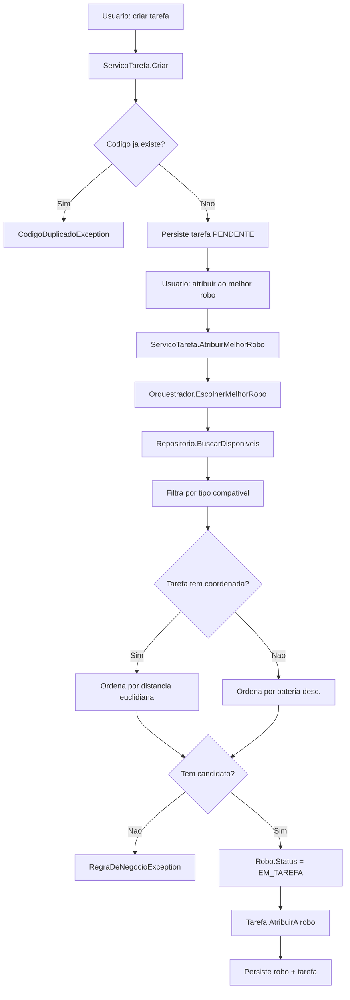
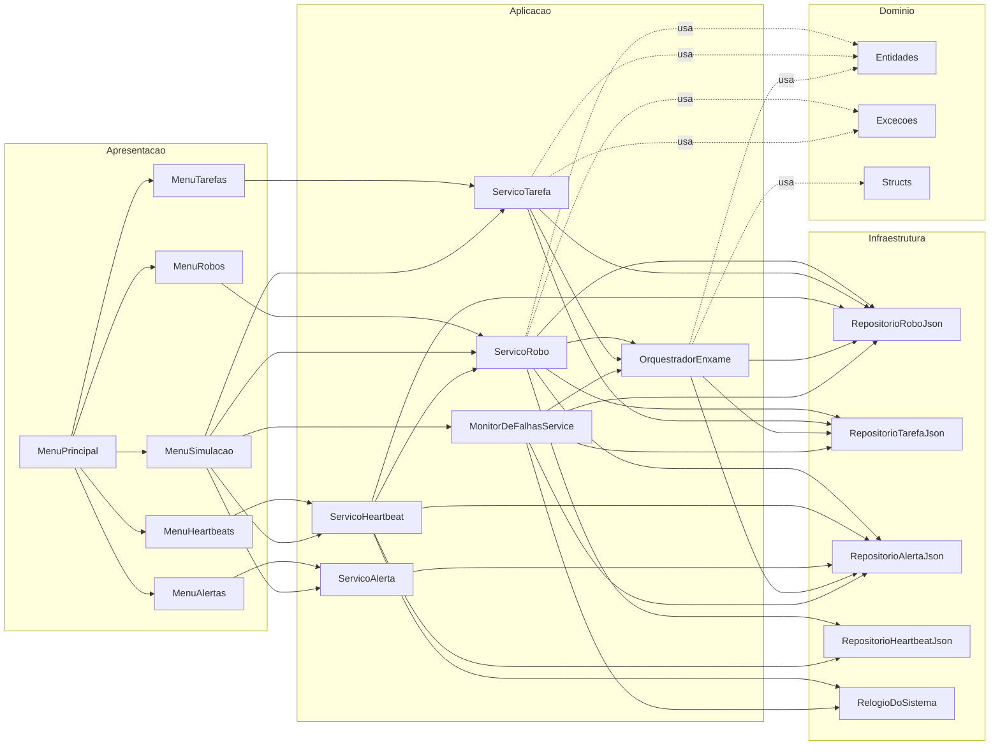

# Diagramas de fluxo - SwarmBuild

Este documento detalha os dois fluxos principais do sistema: **atribuicao de tarefa** e **deteccao de falha + realocacao automatica**.

---

## 1. Atribuicao de tarefa ao melhor robo



---

## 2. Deteccao de falha + realocacao automatica

```mermaid
sequenceDiagram
    autonumber
    participant U as Usuario
    participant MON as MonitorDeFalhasService
    participant REPO as Repositorios JSON
    participant ORQ as OrquestradorEnxame
    participant ALT as Repositorio de Alertas

    U->>MON: Iniciar() ou DetectarRobosOffline()
    Note right of MON: Timer dispara a cada 10s
    MON->>REPO: BuscarOffline(agora - 60s)
    REPO-->>MON: [Robo A]
    MON->>REPO: Robo A.Status = FALHA
    MON->>ALT: Alerta ROBO_OFFLINE (CRITICO)
    MON->>REPO: BuscarEmExecucaoPorRobo(Robo A)
    REPO-->>MON: [Tarefa T-001]
    MON->>ORQ: RealocarTarefa(T-001)
    ORQ->>REPO: T-001.Desatribuir + MarcarRealocada
    ORQ->>REPO: BuscarDisponiveis (mesmo tipo)
    REPO-->>ORQ: [Robo B]
    alt Tem substituto
        ORQ->>REPO: Robo B.Status = EM_TAREFA
        ORQ->>REPO: T-001.AtribuirA(Robo B)
        ORQ->>ALT: Alerta TAREFA_REALOCADA (AVISO)
    else Sem substituto
        ORQ->>ALT: Alerta TAREFA_SEM_ROBO_DISPONIVEL (CRITICO)
    end
```

---

## 3. Camadas e injecao de dependencia



A apresentacao depende apenas dos servicos. Os servicos dependem apenas das interfaces dos repositorios e do orquestrador. As implementacoes concretas (`*Json`) ficam isoladas em `Infraestrutura/` — isso e o que **inversao de dependencia** garante.
